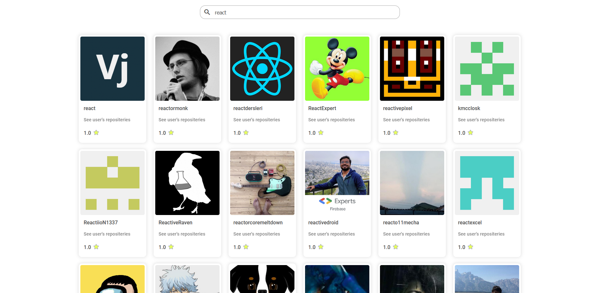

<h1 align="center">react-level-2 - Github-user-search</h1>

<div align="center">
   Solution for a Technical test</a>.
</div>

<div align="center">
  <h3>
    <a href="https://camain-elie.github.io/react-level-2/">
      Demo
    </a>
    <span> | </span>
    <a href="https://github.com/camain-elie/react-level-2">
      Solution
    </a>
  </h3>
</div>

<!-- TABLE OF CONTENTS -->

## Table of Contents

- [Overview](#overview)
  - [Built With](#built-with)
- [Features](#features)
- [How to use](#how-to-use)
- [Contact](#contact)
- [Acknowledgements](#acknowledgements)

<!-- OVERVIEW -->

## Overview



This project was made to complete a frontend technical test for a job application.

### Instructions
Create an input text in which as the user types in, launch a search against Github users and return a result list.

### The subject

- Query against Github Api: GET https://api.github.com/search/users?q={USER}.
- Try to not add any dependency library on a freshly created create react app.
- Don't forget to check against modern ways to make HTTP requests on frontend side.
- Bonus: manage edge cases (no results, github api rate limit)

### Guidelines

- Use React.js to render the view
- Push your code to a Github repository
- Document what you've done


### Built With

As asked in the guidelines, I did not use any dependency librairy. Therefore no css preprocessor or fetch library (like axios) where used, only React and Create-React-App.

- [React](https://reactjs.org/)
- [Create-React-App](https://create-react-app.dev/)

## Features

You can find the source code of the application in the /src folder.

Create an input text in which as the user types in, launch a search against Github users and return a result list.
    --> Done, to increase the number of result shown to the user, a page system (adapted from a previous project) was added.
      The results are presented as cards containing a link to the user's profile, a link to the user's repositeries, the user's score and profile image. 

1. Query against Github Api: GET https://api.github.com/search/users?q={USER}.
    --> To make request to the Github API, I used the fetch() function with promises in a seperate file /services/github.js.

2. Try to not add any dependency library on a freshly created
   [create react app](https://github.com/facebook/create-react-app).
    --> Only a few developpement dependencies.

3. Don't forget to check against modern ways to make HTTP requests on frontend side.
    --> 

4. Bonus: manage edge cases (no results, github api rate limit)
    --> The user gets a message when an error occurs, no results are found or the api rate limit is reached.
    Moreover, to reduce the impact of the api rate limit, a call to the API is send only when the user stops typing for more than one second (instead of every time a key is pressed).

## How To Use

<!-- Example: -->

To clone and run this application, you'll need [Git](https://git-scm.com) and [Node.js](https://nodejs.org/en/download/) (which comes with [npm](http://npmjs.com)) installed on your computer. From your command line:

```bash
# Clone this repository
$ git clone https://github.com/camain-elie/react-level-2

# Install dependencies
$ npm install

# Run the app
$ npm start
```

## Acknowledgements

<!-- This section should list any articles or add-ons/plugins that helps you to complete the project. This is optional but it will help you in the future. For example: -->

- [Stackoverflow - a few answers helped me a lot as usual](https://stackoverflow.com/)
- [React.js](https://fr.reactjs.org/)
- [Github API](https://docs.github.com/en/rest/reference/search#search-users)

## Contact

- GitHub [@camain-elie](https://github.com/camain-elie)
